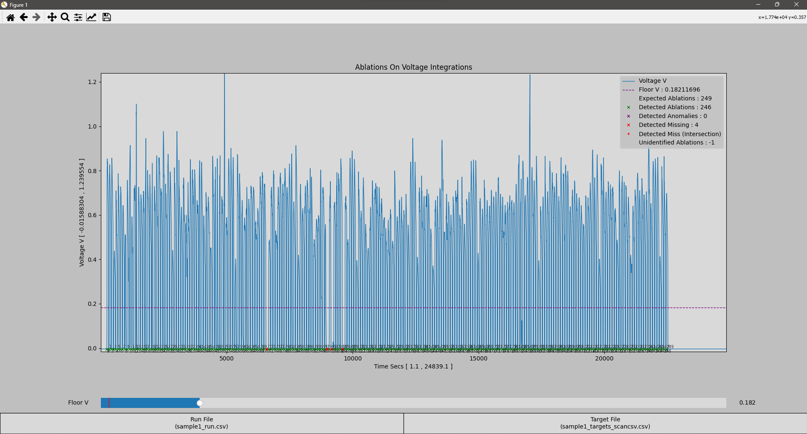
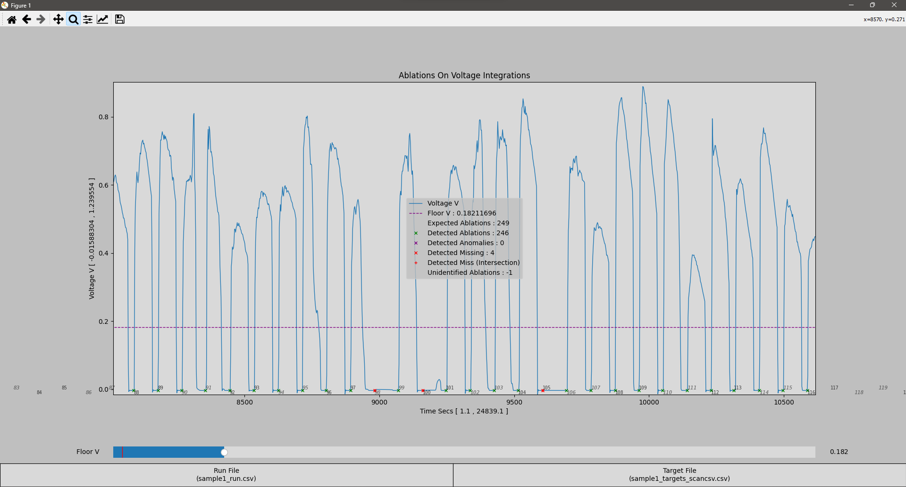

# Voltage Integration Plotter


## Functionality

* This tool locates ablation mismatches between .scancsv and .run files

1. Plots the voltage curve from a given .run csv file
2. Marks the expected ablations from the targets csv file (.scancsv file)
3. Calculates and plots the following coordinates using the current floor value
   1. Detected ablation peaks from the .run file that match expected ablations from the targets file
   2. Missing ablation peaks from the .run file that are visible/expected from the targets file
   3. Anomaly ablation peaks from the .run file that don't line up with expected peaks from the target file

### Sample GUI Plot



### Sample GUI Plot Zoomed



## File Formatting

### .scancsv Files

* .scancsv (target) files are csv formatted files specifying the targets for a given run
* Additional header data preceding the csv is allowed and auto-filtered
* Additional footer data following the csv is NOT allowed
* Sample files at [sample1_run](./samples/sample1_targets_scancsv.csv) and [sample2_run](./samples/sample2_targets_scancsv.csv)
* The length of the extracted csv indicates the expected ablation count
* Individual targets from the .scancsv file must have consistent time spacing
* A line containing csv column names can be included or omitted
* CSV columns :
   | Scan Type | Description | Selected | Lock Edit | Vertex Count | Vertex List | Preablation Settings | Ablation Settings | Data |
   | --------- | ----------- | -------- | --------- | ------------ | ----------- | -------------------- | ----------------- | ---- |
   | ...       | ...         | ...      | ...       | ...          | ...         | ...                  | ...               | ...  |

### .run Files

* .run files are csv formatted files containing the results from a given run
* Additional header data preceding the csv is allowed and auto-filtered
* Additional footer data following the csv is NOT allowed
* Sample files at [sample1_targets](./samples/sample1_run.csv) and [sample2_targets](./samples/sample2_run.csv)
* A line containing csv column names can be included or omitted
* CSV columns :
   | Column 0 | Voltage V (Column 1) | Column 2 ... Column 10 | TimeStamp Secs (Column 11) | etc... |
   | -------- | -------------------- | ---------------------- | -------------------------- | ------ |
   | ...      | ...                  | ...                    | ...                        | ...    |

## Installation

1. Install Python 3.11 or newer
   * Verify via `cmd` with the command `python3 --version`
2. Download the latest vip installer [here](https://github.com/ryanpecha/Voltage-Integration-Plotting/releases)
3. Right click `vipInstaller.exe` and **RUN AS ADMINISTRATOR**
4. Tool shortcuts will be added to the following locations
   1. Desktop (Voltage Integration Plotter)
   2. Start Menu (Voltage Integration Plotter)
   3. File Explorer (`right click` any file or folder and select `Open with VIP`)

## Development

### Developer Installation

```cmd
git clone https://github.com/ryanpecha/Voltage-Integration-Plotting.git
cd ./Voltage-Integration-Plotting/
python3 -m pip install -r ./requirements.txt
python3 -m pip install -r ./badges/requirements.txt
```

### Developer Tools

#### Python Version Badge Generator

* Generates [pyVersionsBadge.svg](./badges/pyVersionsBadge.svg) for display in [README.md](./README.md)

```cmd
./badges/genBadge.bat
```

## Citation Format

> Pecha, R. A. (*versionYear*, *versionMonth* *versionDay*). Voltage-Integration-Plotting Version (*version*). Retrieved *retrieveMonth* *retrieveDay*, *retrieveYear*, from https://github.com/ryanpecha/Voltage-Integration-Plotting. 
