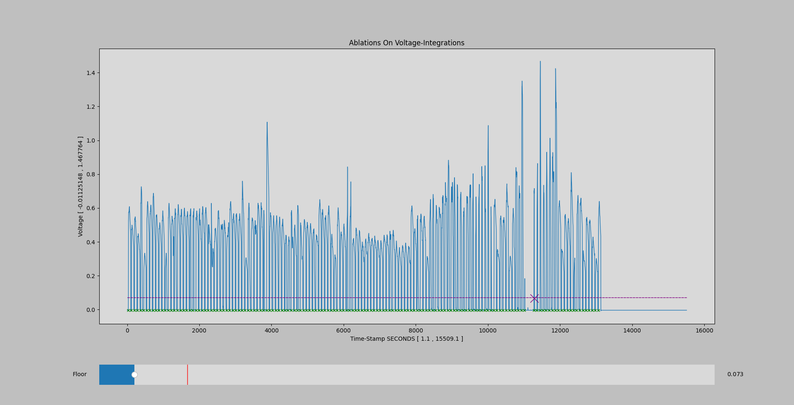
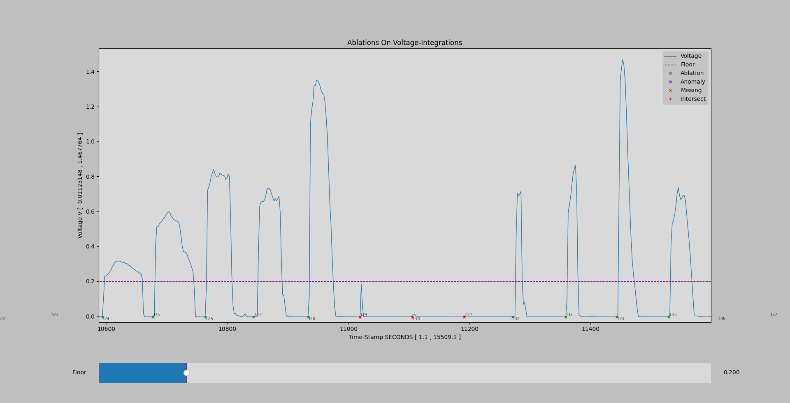

# Voltage-Integration-Plotting

## **Dependencies**

* Python 3.10.8
* Python must be installed with tkinter
* All commands are listed for Powershell
* All dependencies are listed @ `requirements.txt`
* UI variation indicates you are missing PyQT5
* Data must have more valid ablations than errors
* All indices start at 0, including index based args
* Start indices should not include column header data

### **Installing Dependencies**

```cmd
pip install -r .\requirements.txt
```

---

## **Plotting Data - Easy**

> Automatically prompts the user for necessary arguments

```cmd
python.exe .\EasyPlot.py
```

---

## **Plotting Data - Command Line**

> Requires the user to pass desired command line arguments

```cmd
python.exe .\PlotIntegrations.py
```

## **Arguments - Data Plotting**

| Arg Name       | Default Arg Value      | Arg Type | Example                    | Description                                               |
| -------------- | ---------------------- | -------------- | -------------------------- | --------------------------------------------------------- |
| iPath          | sampleIntegrations.csv | string         | -iPath myInts.csv | Path to your voltage integrations csv file                |
| aPath          | sampleAblations.csv    | string         | -aPath myAbls.csv     | Path to your ablations csv file                           |
| iTimeStampIndex | 0                      | int            | -iTimeStampIndex 11         | Column index of your voltage timeStamps (iPath)           |
| iVoltageIndex   | 1                      | int            | -iVoltageIndex 0            | Column index of your voltage values (iPath)              |
| iStartRowIndex | 0                      | int            | -iStartRowIndex 20         | Starting row index of your ints csv data (iPath) |
| aStartRowIndex | 0                      | int            | -aStartRowIndex 20         | Starting row index of your abls csv (aPath)         |

## **Run Example**

```cmd
python.exe .\PlotIntegrations.py -iTimeStampIndex 11 -iVoltageIndex 1
```

**YIELDS:**



**ZOOMED:**


